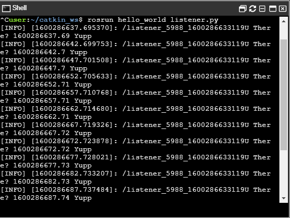
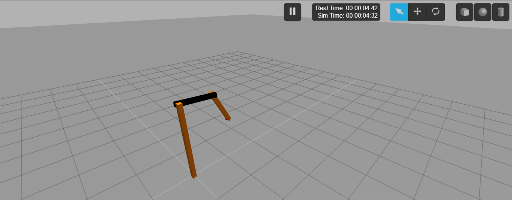

# ROS Basics
This repository consists of a small hello world program and rrbot controller.

## Hello World for ROS

Most of us started our coding with a hello world program. We can do the same with ROS.
We need a publisher node, a subscriber node and a topic to know how ROS communicates.

I made a package named **hello_world**. It consists of a folder called scripts.

*Note:We can add all out python scripts here in this folder. It is not mandatory but it is a good practice to arrage them in a separate folder.*

In the hello_world package, we have two files **talker.py** and **listener.py**. The talker.py consists of a node called talker which publishes a String, let's say 'U there?', to the topic called 'chat'. The listener.py conssist of a node called listener which subscribes the topic 'chat' and confirms with a text 'Yupp'.
 
### How to Run?

We can run the scripts using the command **rosrun package_name file_name**.

### Here's how it works

## Controlling RRBot

RRBot is a "Revolute-Revolute Manipulator Robot" which has 2 joints. It is a simple robotic arm which helps us to know how joints work and how to control their positions.
We can design a similar robot in Fusion 360 and export the URDF but as we need a basic understanding, we can directly clone this [repository](https://github.com/ros-simulation/gazebo_ros_demos) and run the commands given in the same repo. Those commands actually spawn the robot model in rviz,gazebo and start the nodes to control. So these jonts can take Float64 type inputs. So from the file in **/gazebo_ros_demos/rrbot_control/rrbot_control.py**, we are publishing the values to two different topics which are controlling the joint positions.You can understand if you go through the code and implement it by yourself.

We can run the script using the command **rosrun package_name file_name**cas we did above.

### Here's how it works

